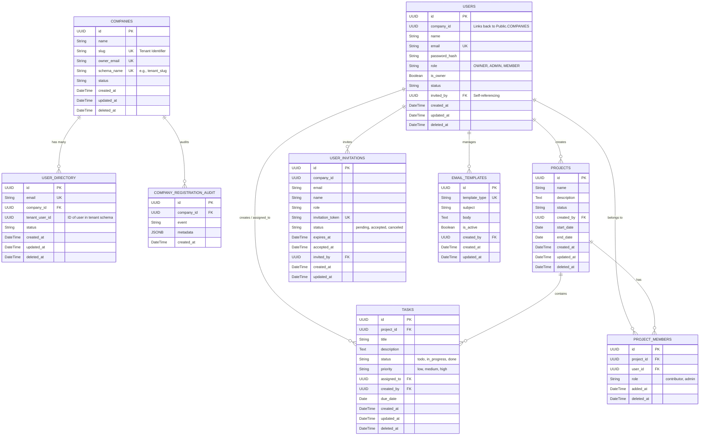

# Database Architecture & ER Diagram

This document contains the Entity-Relationship (ER) diagram for the SaaS platform. Since the application uses a **schema-per-tenant** architecture, the database is split into two logical areas: the **Public Schema** (for global routing and company management) and the **Tenant Schema** (which is replicated for each registered company workspace).

