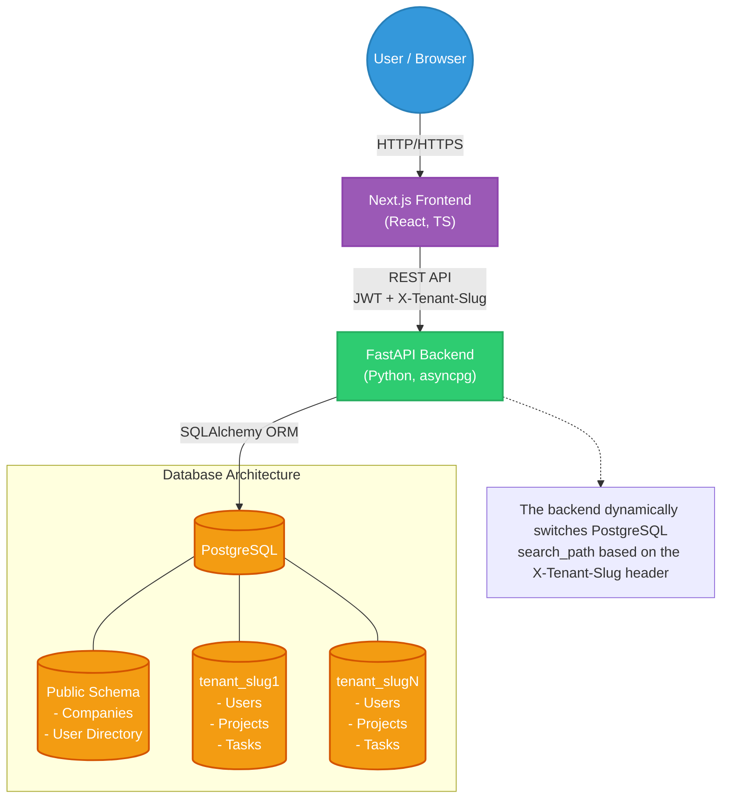

# 🏢 TenantBase Project Management SaaS

[](https://fastapi.tiangolo.com/)
[](https://nextjs.org/)
[](https://www.postgresql.org/)
[](https://www.typescriptlang.org/)

A robust, schema-based **multi-tenant project management SaaS** platform. This application is designed to offer isolated workspaces (tenants) where teams can collaborate, manage projects, and organize tasks securely. It leverages PostgreSQL schemas for strict data isolation, ensuring enterprise-level security and performance.

---

## 🌟 Key Features

- **Schema-Based Multi-Tenancy:** Each registered company gets its own dedicated PostgreSQL schema (`tenant_<slug>`), ensuring complete data isolation.
- **Role-Based Access Control (RBAC):** Fine-grained permissions featuring `OWNER`, `ADMIN`, and `MEMBER` roles.
- **Invitation System:** Secure, token-based email invitations for onboarding new team members into a specific tenant workspace.
- **Project & Task Management:** Create projects, organize tasks using a Kanban-style layout, and assign them to team members.
- **Modern Tech Stack:** Built with a highly concurrent ASGI Python backend (FastAPI) and a reactive frontend (Next.js App Router).

---

## 🏗️ System Architecture

The application adopts a decoupled frontend and backend architecture, connected via a RESTful API. Below is a high-level component graph of the system:



---

## 🛠️ Technology Stack

### Backend
- **Framework:** [FastAPI](https://fastapi.tiangolo.com/) - High performance, asynchronous web framework.
- **Database:** PostgreSQL with [asyncpg](https://magicstack.github.io/asyncpg/current/) driver.
- **ORM:** [SQLAlchemy 2.0](https://www.sqlalchemy.org/) (Async Engine).
- **Migrations:** [Alembic](https://alembic.sqlalchemy.org/) for managing dynamic schema migrations.
- **Authentication:** JWT (JSON Web Tokens) with Password Hashing (bcrypt).
- **Email:** `fastapi-mail` for sending SMTP-based invitations.

### Frontend
- **Framework:** [Next.js](https://nextjs.org/) (React 18, App Router).
- **Language:** TypeScript for end-to-end type safety.
- **Styling:** Vanilla CSS (or Tailwind if configured).
- **State Management:** React Context API (`UserContext`).

---

## 📂 Project Structure

```text
tenant_base_company/
├── backend/                  # FastAPI Application
│   ├── app/                  
│   │   ├── api/v1/           # API Endpoints (Auth, Users, Projects)
│   │   ├── core/             # Settings, Security, Exceptions
│   │   ├── db/               # Database config and mixins
│   │   ├── dependencies/     # Dependency Injection (Tenant resolving)
│   │   ├── models/           # SQLAlchemy Models (Public & Tenant)
│   │   ├── repositories/     # Data Access Layer (CRUD operations)
│   │   └── services/         # Business Logic Layer
│   ├── alembic/              # Migration Scripts
│   ├── main.py               # Application Entry Point
│   └── requirements.txt / uv.lock
│
└── frontend/                 # Next.js Application
    ├── src/
    │   ├── app/              # Next.js App Router Pages
    │   │   ├── [slug]/       # Tenant-specific routes (Dashboard, Projects)
    │   │   ├── accept-invite/# Invitation acceptance flow
    │   │   ├── login/        # Global login
    │   │   └── register/     # Company registration
    │   ├── components/       # Reusable UI components
    │   └── lib/              # API utilities & helpers
    └── package.json          # Node dependencies
```

---

## 🔐 Multi-Tenancy Mechanism Explained

This project utilizes a **Schema-per-Tenant** architecture. 
1. **Public Schema:** Holds global data like registered companies and a master user directory mapping emails to tenant IDs.
2. **Tenant Schemas:** Every time a new company registers, a new schema named `tenant_<company_slug>` is dynamically created.
3. **API Routing:** The frontend attaches an `X-Tenant-Slug` HTTP header to requests. The backend intercepts this header using a dependency (`get_tenant_db`), validates the company in the public schema, and sets the PostgreSQL `search_path` to that specific tenant's schema before executing queries.

This ensures that queries logically cannot leak data across workspaces.

---

## 🚀 Getting Started

### 1. Database Setup
Ensure you have PostgreSQL running. Create a database:
```sql
CREATE DATABASE tenant_db;
```

### 2. Backend Setup
Navigate to the `backend` directory and set up your Python environment:
```bash
cd backend
python3 -m venv .venv
source .venv/bin/activate
pip install -r requirements.txt # or use `uv sync` if utilizing uv
```

Create a `.env` file in the `backend/` directory:
```ini
PROJECT_NAME="Multi-Tenant Project Management SaaS"
SECRET_KEY="your-super-secret-jwt-key"
POSTGRES_SERVER="localhost"
POSTGRES_USER="postgres"
POSTGRES_PASSWORD="yourpassword"
POSTGRES_DB="tenant_db"
FRONTEND_URL="http://localhost:3000"

# SMTP Settings
SMTP_TLS="True"
SMTP_PORT="587"
SMTP_HOST="smtp.gmail.com"
SMTP_USER="your-email@gmail.com"
SMTP_PASSWORD="your-app-password"
```

Run the backend server:
```bash
uvicorn app.main:app --reload --host 0.0.0.0 --port 8000
```

### 3. Frontend Setup
Navigate to the `frontend` directory:
```bash
cd frontend
npm install
```

Start the Next.js development server:
```bash
npm run dev
```

Visit `http://localhost:3000/register` to create your first workspace!

---

## 🛡️ License
This project is proprietary and confidential.
